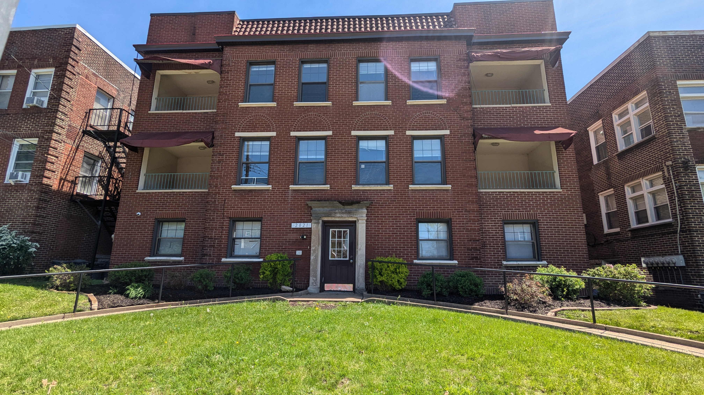

Burlington Property, LLC is pleased to offer spacious two-bedroom one-bathroom (2br/1ba) apartments at 2021 Wendover St. in South Squirrel Hill.
Each apartment offers air conditioning, spacious living and dining areas, kitchen with dishwasher, garbage disposal, and full-sized kitchen range.
Enjoy relaxing time outdoors in the building's private rear patio.

# LOCATION
* Close to Carnegie Mellon University ([map](https://maps.app.goo.gl/JdUkNtLNVQs4dSJ47))
* Close to Pitt and UPMC hospitals ([map](https://maps.app.goo.gl/u48HW7xRuaK9dc1T8))
* Easy walk to the Squirrel Hill Business District
  * Grocery stores, restaurants, coffee shops, etc.
  * 10 minutes to Murray Ave ([map](https://maps.app.goo.gl/FTqzJCodj5L5LFR98))
* Close to both Schenley Park ([map](https://maps.app.goo.gl/H7GHYY4tW4WSksxh9)) and Frick Park ([map](https://maps.app.goo.gl/o8zVJSQfPbRw38ge9))
* Conveniently located near public transportation (bus stops less than 5 minutes away)

*Burlington Property LLC is a Pennsylvania LLC.*

